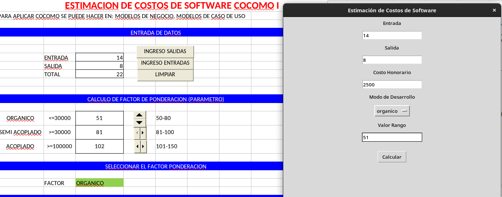
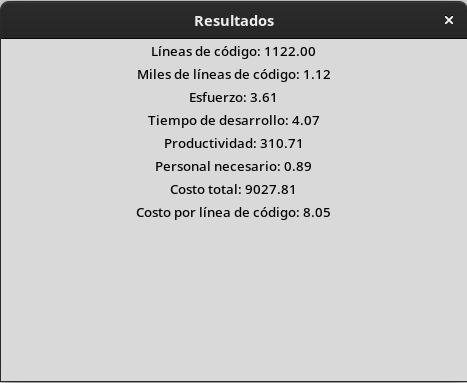

# Estimación de Costos de Software - COCOMO

Esta aplicación permite estimar los costos de desarrollo de software utilizando el modelo COCOMO (Constructive Cost Model). La interfaz gráfica está construida con Python y la biblioteca `tkinter`.

## Requisitos

- Python 3.x
- Biblioteca `tkinter` (generalmente incluida con Python)

## Instalación

1. **Clonar el repositorio**:
   ```bash
   git clone https://github.com/erwinapz/cocomo-1.git
   cd cocomo-1

2. **Ejecutar la aplicación**: 
    
    Asegúrate de tener Python instalado en tu sistema. Luego, ejecuta el siguiente comando en la terminal:

    ```bash
    python3.x cocomo_estimador_costos.py
    ```
## Uso

### Interfaz de entrada:

Abre la aplicación y verás un formulario donde puedes ingresar los siguientes datos:
- Entrada: Número de entradas del software.
- Salida: Número de salidas del software.
- Costo Honorario: Costo por mes del trabajo.
- Modo de Desarrollo: Selecciona entre "Orgánico", "Semi-Acoplado" o "Acoplado".
- Valor Rango: Un valor que debe estar dentro de un rango específico según el modo de desarrollo seleccionado.

**Captura de las entradas para la estimacion de costos**



### Calcular:

Haz clic en el botón "Calcular" para obtener los resultados de la estimación.

### Resultados:

Se abrirá una nueva ventana mostrando los resultados de la estimación, que incluyen:
- Líneas de código
- Miles de líneas de código
- Esfuerzo
- Tiempo de desarrollo
- Productividad
- Personal necesario
- Costo total
- Costo por línea de código

**Captura de resultados de la estimacion de costos**


